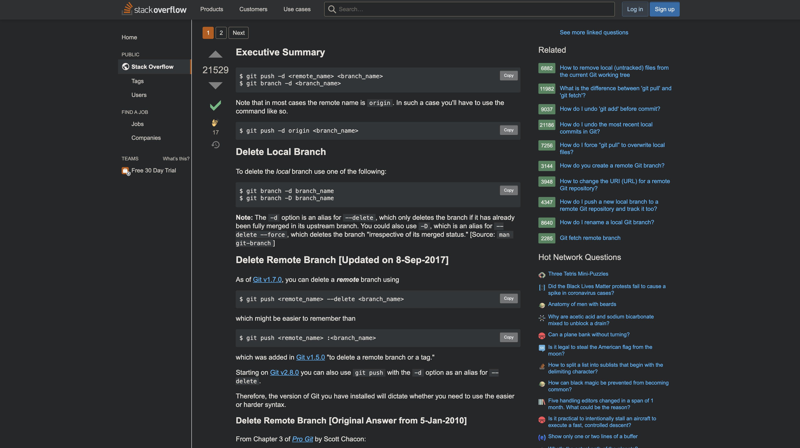
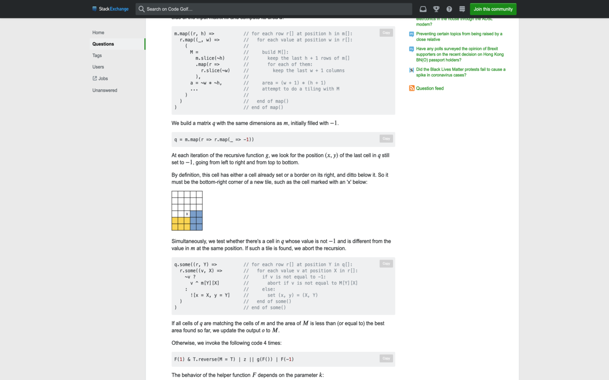

<h1 align="center">stackcopy</h1>

  <strong>A browser extension to copy code-snippets from Stack Exchange sites 🔖</strong>

_______________________________________________________

Copy code-snippets to your clipboard with ease from any Stack Exchange site.

Stack Overflow:

Code Golf:

